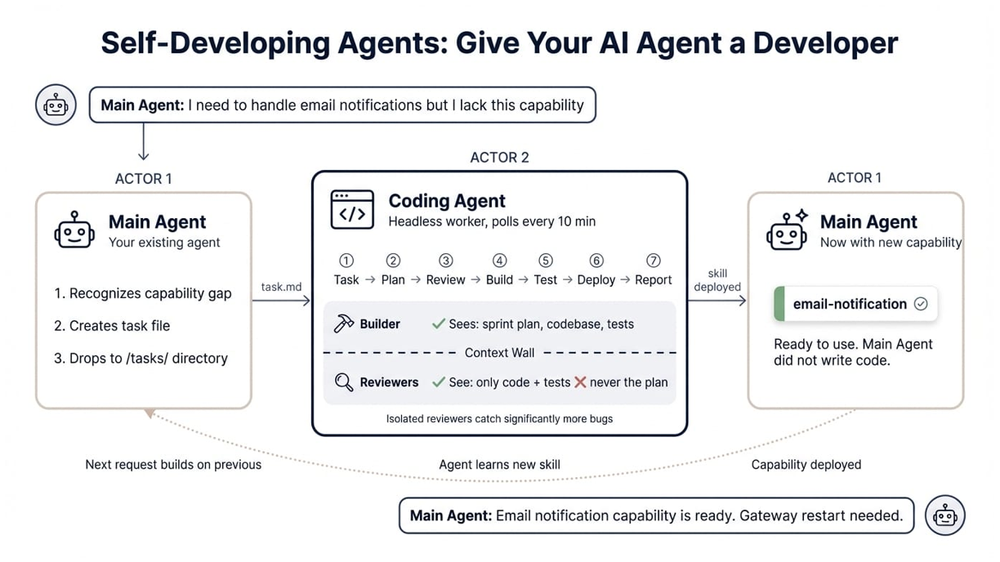
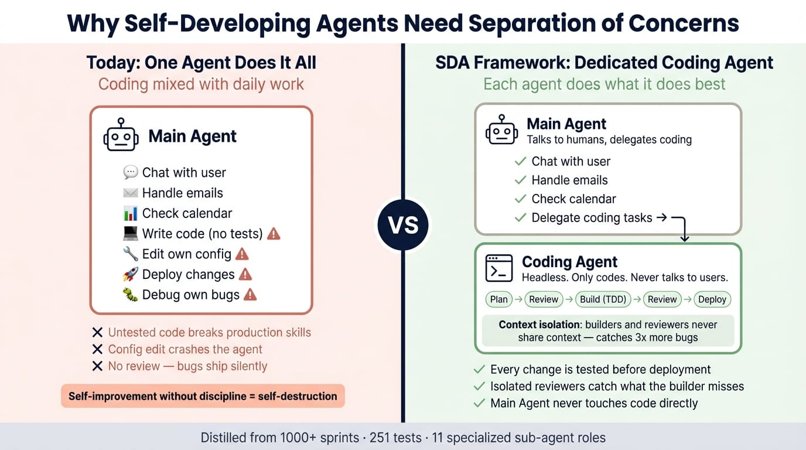

# Self-Developing Agents Framework





**Give your AI agent a developer.** This framework deploys a headless Coding Agent alongside your existing agent. When your agent lacks a capability, the Coding Agent builds it — writes the code, tests it, reviews it with isolated sub-agents, and deploys it directly to your agent's workspace.

Distilled from 1000+ sprints of real-world agent-driven development. 313 tests. Battle-tested.

## What Happens When You Deploy This

```
You: "I need my agent to handle email notifications"

Your Agent (Main):
  → Recognizes it can't do this
  → Creates a task file for the Coding Agent

Coding Agent (headless worker, polls every 10 min):
  → Picks up the task
  → Plans the sprint (creates sprint plan)
  → Reviews the plan with architect + code reviewer sub-agents
  → Implements with TDD (test first, then code)
  → Reviews implementation with debugger + security sub-agents
  → Deploys the new "email-notification" skill to your agent's workspace
  → Writes a delivery report: "Email skill deployed. Gateway restart needed."

Your Agent:
  → Reads the delivery report
  → Tells you: "New email notification capability is ready"
```

Your agent just improved itself in a managed way.

## Quick Start (Any Platform)

Your agent needs 3 capabilities: **read files**, **write files**, **run shell commands**.

```bash
# Clone the repo
git clone <repo-url> /tmp/sda-install

# Deploy a headless Coding Agent alongside your Main Agent
bash /tmp/sda-install/install.sh \
  --agent-workspace /path/to/coding-agent/workspace \
  --main-workspace /path/to/main-agent/workspace
```

This copies the framework, sets up the Coding Agent's workspace with skills + task directories, and appends routing rules to your Main Agent's config.

**Or tell your existing agent to do it** (if it has shell access):

> "Clone the self-developing agents framework and install it:
> `git clone <repo-url> /tmp/sda && bash /tmp/sda/install.sh --agent-workspace /path/to/new-workspace --main-workspace /path/to/your/workspace`"

### OpenClaw Users

Add the `--openclaw` flag for platform-specific integration (patches openclaw.json, creates auth, restarts gateway):

```bash
bash install.sh \
  --agent-workspace /home/openclaw/.openclaw/workspace-dev-agent \
  --main-workspace /home/openclaw/.openclaw/workspace \
  --openclaw --agent-id dev-agent
```

See [deploy/openclaw/README.md](deploy/openclaw/README.md) for detailed OpenClaw setup.

## The Core Idea: Context Isolation

> In our experience across 170+ sprints, we consistently catch significantly more bugs when critique comes from agents that never saw the original sprint plan.

When a single agent builds and reviews, it reads its own output through the lens of its intent and persuades itself everything is fine. This framework enforces strict separation: the agent that writes code **never** reviews it. Quality reviewers see only the code and tests — never the sprint plan or the developer's intent.

## How It Works: The 7-Stage Cycle

Every feature the Coding Agent builds follows this exact sequence. Python validators enforce that no stage is skipped.

| Stage | What Happens | Enforced By |
|-------|-------------|-------------|
| 1. Task Recognition | Coding Agent polls for new tasks | poll-tasks.py |
| 2. Sprint Planning | Creates sprint plan with goal, approach, tests | validate_sprint.py |
| 3. Plan Review | 2+ review iterations by isolated sub-agents | validate_sprint.py |
| 4. Implementation | TDD: write failing test, then code, then refactor | validate_tdd.py |
| 5. Post-Impl Review | 2-5 gap analysis iterations (reviewers never see the plan) | validate_sprint.py |
| 6. Deployment | Deploy built skill to Main Agent's workspace | deploy-to-agent.py |
| 7. Documentation | Update progress, roadmap, features, delivery report | validate_rdd.py |

## Three-Tier Architecture

```
Human (request)
  └→ Main Agent (router — talks to human, delegates coding tasks)
       └→ Coding Agent (headless worker — builds, tests, deploys)
            ├→ Research Agents (may share context)
            │   ├ researcher (fast codebase exploration)
            │   └ analyzer (deep component analysis)
            └→ Quality Agents (strict context isolation)
                ├ architect-reviewer
                ├ code-reviewer
                ├ debugger
                ├ security-auditor
                └ performance-reviewer
```

The Main Agent and Coding Agent communicate via file-based task dispatch. The Coding Agent deploys built capabilities directly to the Main Agent's workspace using `deploy-to-agent.py` with atomic JSON patching, backup, and rollback.

## What's Inside

```
├── install.sh                One-command installer (works on any platform)
├── BOOTSTRAP.md              Day 1 setup (manual path)
├── AGENT_INSTRUCTIONS.md     16 operating rules
│
├── architecture/             System design docs
│   ├── SYSTEM_DESIGN.md      3-tier architecture + task dispatch
│   ├── ROUTING_RULES.md      How tasks flow between agents
│   └── CONTEXT_ISOLATION.md  Why isolation catches more bugs
│
├── practices/                9 development methodology guides
│   ├── GL-TDD.md, GL-RDD.md, GL-ERROR-LOGGING.md
│   ├── GL-SPRINT-DISCIPLINE.md, GL-SELF-CRITIQUE.md
│   ├── GL-DEPLOYMENT.md, GL-CONTEXT-MANAGEMENT.md, GL-TEMPLATE-ENFORCEMENT.md
│   └── GL-DOC-RECONCILIATION.md   (added SP_001 — frontmatter, single-source, TBD-by, reconciliation checklist)
│
├── roles/                    11 sub-agent role definitions + index
│
├── templates/                13 project structure templates
│
├── skills/                   Executable capabilities
│   ├── dev-bootstrap/        Day 1 workspace setup
│   ├── dev-sprint/           Sprint planning + doc updates
│   ├── dev-critique/         Sub-agent orchestration (gather-context + parse-findings)
│   └── dev-deploy/           Validation, git push, task polling, cross-agent deployment
│
├── validators/               Python enforcement
│   ├── validate_structure, validate_workspace, validate_tdd, validate_rdd, validate_sprint
│   └── validate_doc_reality (added SP_001 — dead paths, TBD-by decay, frontmatter, paired-file duplication)
│
├── deploy/openclaw/          OpenClaw-specific extras
│   ├── README.md             Detailed OpenClaw setup guide
│   └── templates/            IDENTITY, SOUL, USER, TOOLS for the Coding Agent
│
└── examples/                 Real sprint plan + self-critique examples
```

## Prerequisites for Auto-Deploy

For an agent to clone this repo and deploy the Coding Agent autonomously, it needs exactly **3 capabilities**:

| Capability | What it's used for | Examples |
|---|---|---|
| **Read files** | Read BOOTSTRAP.md, AGENTS.md, SKILL.md, role definitions | OpenClaw workspace access, Claude Code Read tool, Cursor file access |
| **Write files** | Create workspace, task files, sprint plans, delivery reports | OpenClaw workspace access, Claude Code Write tool, Cursor file access |
| **Run shell commands** | Clone repo, run install.sh, execute Python scripts, run validators | OpenClaw `system.run`, Claude Code Bash tool, Cursor terminal |

If your agent has these 3 capabilities, tell it:

> "Clone `<repo-url>` and run `bash install.sh --agent-workspace <path> --main-workspace <your-workspace>`"

The agent will deploy the Coding Agent alongside itself.

### Server Requirements

- **Python 3.13+** (for validators and skills)
- **Git** (for version tracking — validators degrade gracefully without it)
- **bash** (for the installer)

### Platform-Specific Extras

| Platform | Extra flag | What it adds |
|---|---|---|
| OpenClaw | `--openclaw` | Patches openclaw.json, creates auth dir, restarts gateway |
| Claude Code | none needed | Agent reads BOOTSTRAP.md and follows it using built-in tools |
| Cursor / Aider | none needed | Same — agent reads docs and uses shell |

## Configuration

Create `.validators.yml` in your project root to customize. The file is shared across validators; each consumer ignores keys it does not recognize.

```yaml
# validate_workspace.py
bootstrap_files: [AGENT_INSTRUCTIONS.md, AGENT_IDENTITY.md]

# validate_structure.py
src_dir: src/
required_files: [PROJECT_CONTEXT.md, ARCHITECTURE.md, PROGRESS.md]
required_dirs: [test/unit, test/integration]
layer_rules:
  models: {forbidden_imports: [requests, subprocess]}

# validate_doc_reality.py
doc_reality:
  exclude_dirs: []                    # extends defaults (templates, vision, examples, etc.)
  dead_path_exclusions: []            # literal token strings allowed to be "dead"
  dead_path_glob_exclusions: []       # fnmatch patterns (e.g., PROGRESS_ARCHIVE_*.md)
  frontmatter_required:               # meta-docs that must carry frontmatter
    - PROGRESS.md
    - PROJECT_ROADMAP.md
    - FEATURE_LIST.md
  paired_files:                       # files checked for duplication
    - [AGENT_INSTRUCTIONS.md, CLAUDE.md]
  duplication_threshold: 30
```

All settings optional — sensible defaults built in.

## Documentation Reality Discipline (SP_001)

The framework also enforces that meta-documentation stays aligned with shipped reality. Drift is a structural problem (aspirational docs frozen in time, copy-paste duplication, dead path references, stale `TBD` markers) — `validators/validate_doc_reality.py` is the structural fix.

Four stages, each independently skippable:

| Stage | Catches |
|---|---|
| A — Dead paths | Backtick-wrapped path references in meta-docs that no longer exist on disk |
| B — TBD-by decay | `TBD-by: SP_NNN` markers whose target sprint has already elapsed (per `PROGRESS.md`) |
| C — Frontmatter | Missing/malformed `status` and `last-reconciled` keys; explicitly rejects the `1970-01-01` template sentinel |
| D — Duplication | Long identical runs between paired files (e.g., `AGENT_INSTRUCTIONS.md` ↔ `CLAUDE.md`); use `@inherits:` to mark intentional inheritance |

Conventions are codified in [`practices/GL-DOC-RECONCILIATION.md`](practices/GL-DOC-RECONCILIATION.md). Rule 16 of `AGENT_INSTRUCTIONS.md` requires running this validator before deploy and completing a Doc Reconciliation Checklist at Stage 7.

## Numbers

- **77 files** in the framework
- **313 tests** passing
- **9 practice guides** (TDD, RDD, error handling, sprint discipline, self-critique, deployment, context management, template enforcement, **doc reconciliation**)
- **11 sub-agent roles** for research and quality review
- **6 validators** enforcing the 7-stage cycle (structure, workspace, TDD, RDD, sprint, **doc-reality**)
- **4 executable skills** automating the development lifecycle
- **1 platform-agnostic installer** (one command, works on any agent with read/write/shell)

## Recent Sprints

- **SP_001 (2026-04-13) — Doc Reality Discipline.** Added `validate_doc_reality.py` (4 stages), `GL-DOC-RECONCILIATION.md`, Rule 16, frontmatter on 7 meta-doc templates, Doc Reconciliation Checklist in `SPRINT_PLAN.md`, seeded `.validators.yml`. The framework repo now passes its own new validator with exit 0. See [`workspace/sprints/SP_001_Doc_Reality_Discipline.md`](workspace/sprints/SP_001_Doc_Reality_Discipline.md).

## License

MIT
